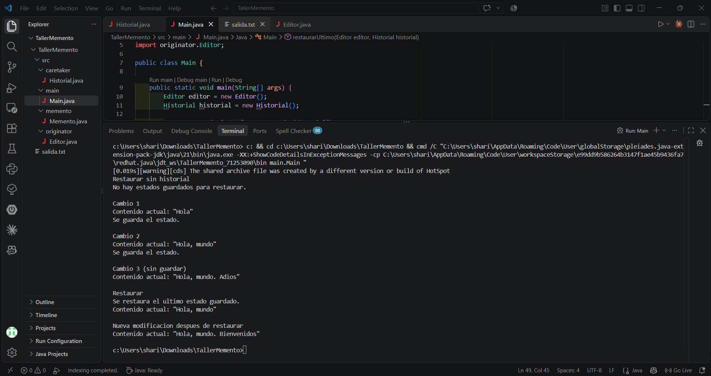

# Taller Memento - Editor de texto con historial

**Nombre:** Sharon Stefany Castilla Araque
**Curso:** Modelos de Programación
**Tema:** Patrón de diseño comportamental Memento (Java)

## Descripción

Editor de texto sencillo que permite escribir contenido, guardar su estado y restaurar un estado anterior usando el patrón Memento.

## Estructura del proyecto

```
src/
├── memento/Memento.java
├── originator/Editor.java
├── caretaker/Historial.java
└── main/Main.java
```

## Roles del patrón

| Rol | Clase | Responsabilidad |
|---|---|---|
| Originator | `Editor` | Maneja su propio contenido, crea su Memento con `guardar()` y se restaura con `restaurar()` |
| Memento | `Memento` | Guarda una copia del contenido. Es inmutable (atributo `private final`, sin setter) |
| Caretaker | `Historial` | Guarda los Mementos en un `Stack<Memento>` sin modificar nunca el Editor |

## Cómo ejecutar

Desde la carpeta `src`:

```
javac -d ../out memento/Memento.java originator/Editor.java caretaker/Historial.java main/Main.java
java -cp ../out main.Main
```

También se puede correr desde VS Code con **Run main** sobre el método `main` de `Main.java`.

## Salida en consola



Salida en texto:

```
Restaurar sin historial
No hay estados guardados para restaurar.

Cambio 1
Contenido actual: "Hola"
Se guarda el estado.

Cambio 2
Contenido actual: "Hola, mundo"
Se guarda el estado.

Cambio 3 (sin guardar)
Contenido actual: "Hola, mundo. Adios"

Restaurar
Se restaura el ultimo estado guardado.
Contenido actual: "Hola, mundo"

Nueva modificacion despues de restaurar
Contenido actual: "Hola, mundo. Bienvenidos"
```

Después de restaurar, el contenido del Editor vuelve a `"Hola, mundo"`, que es el último estado guardado.
